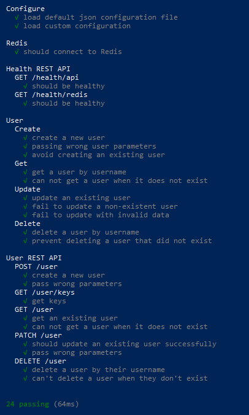
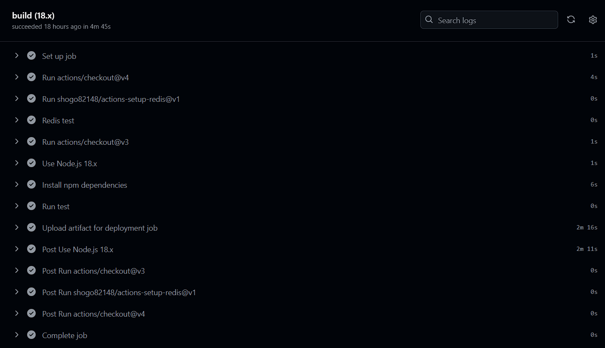

# DevOps Project

Web application developed as part of the DevOps project for the 4th year of engineering studies at ECE Paris.


## Project Overview

This project showcases a fully functional DevOps pipeline, including an enriched web application with automated tests, CI/CD integration, containerization, orchestration, and accurate documentation. Below is the current state of the project:

| Subject                                                        | Code  | DONE |
|----------------------------------------------------------------|:-------:|:------:|
| Enriched web application with automated tests                 | APP   | ✅    |
| Continuous Integration and Continuous Delivery (and Deployment)| CICD  | ✅     |
| Infrastructure as code using Ansible                          | IAC   | ✅     |
| Containerisation with Docker                                   | D     | ✅     |
| Orchestration with Docker Compose                             | DC    | ✅     |
| Orchestration with Kubernetes                                 | KUB   | ✅     |
| Service mesh using Istio                                       | IST   | ✅     |
| Accurate project documentation in README.md file              | DOC   | ✅    |
| More functionnalities added to userAPI (PATCH, DELETE ect)      | BNS   | ✅    |
| Swagger integration       | BNS   | ✅    |


## Prerequisite

To run the project you'll need to have the following programs installed on your computer :
* [git](https://git-scm.com/downloads)
* [NodeJS](https://nodejs.org/en) and [NPM](https://docs.npmjs.com/cli/v10/configuring-npm/install)
* [chocolatey](https://chocolatey.org/install) if you want to install npm and node easily on windows
* [docker](https://docs.docker.com/get-started/get-docker/)
* [redis](https://redis.io/resources/mit-report-genai/)
* [minikube](https://minikube.sigs.k8s.io/docs/start/?arch=%2Fwindows%2Fx86-64%2Fstable%2F.exe+download) and [kubctl](https://kubernetes.io/docs/tasks/tools/)
* [virtualbox](https://www.virtualbox.org/wiki/Downloads) or [vmware](https://www.vmware.com/)

## APP USAGE

This web application provides a REST API for CRUD functionalities using a Redis database.

### Installation
1. Clone the repository
2. Navigate to the project directory and install the dependencies by running:
    ``` 
    npm install
    ```
3. If Redis cannot be installed locally, use the following command to start Redis via Docker:
    ``` 
    docker-compose up -d
    ```
    This command should be run from the misc folder.

## USERAPI

To run the application you need to be in the ./userApi folder and run the following command :  
``` 
npm start
```   
It will start the server at the following address : > http://localhost:3000  

  

## LIST OF REQUEST :

To test a request you can use curl or Postman (Postman is easier to use)  

1. Create a User

    - **POST** request to: http://localhost:3000/user
    - Request body :
    ``` 
    {
    "username": "snaxx",
    "firstname": "thibault",
    "lastname": "leonardon"
    }
    ```

    - Response:
    ``` 
    { "status": "success", "msg": "OK" } 
    ``` 


2. Get All Usernames

    - **GET** request to http://localhost:3000/user/keys
    - Response
    ``` 
    {
        "status": "success",
        "msg": [
            "toche",
            "user",
            "snaxx"
        ]
    }
    ```


3. GET user information by Username

    - GET request to: http://localhost:3000/user/:username
    - Response :
    ``` 
    {
        "status": "success",
        "msg": {
            "firstname": "thibault",
            "lastname": "leonardon"
        }
    }
    ```


4. DELETE a User

    - DELETE request to: http://localhost:3000/user/:username
    - Response :
    ``` 
    {
        "status": "success",
        "msg": 1
    }
    ```

5. Update User Information

    - PATCH request to: http://localhost:3000/user
    - Response :
    ```
    {
        "status": "success",
        "msg": "User updated successfully"
    }
    ```

6. Health status

    - **GET** requests to :
        - http://localhost:3000/health/api
        - http://localhost:3000/health/redis
    ``` 
    {
    "uptime": 930.4953994,
    "status": "API OK",
    "timestamp": 1735285820884
    }

    {
    "uptime": 911.4968297,
    "status": "REDIS OK",
    "timestamp": 1735285801886
    }
    ```

## API Documentation
Swagger documentation is available at: http://localhost:3000/api-docs
  

## API TESTS

We made a serie of tests verify that the API's working well you can try them by running the following command : `npm run test`
And it will show you the results of all the tests :
  
You can see that in the tests we try things that can 'break' the app, like creating an existing user, deleting a non existing user ect.  
If all is green that's significate that all is working.


## Apply CI/CD pipeline

We used Github Actions to create a CI/CD pipeline


### CI
We can see in the following screenshot that all is working for the continuous integration and that significate that new code pushed integrates well with the old one.  


### CD

We chosed Azure Web app service to deploy our app.
To use the app on Azure deployment please use this [link](userapi-thibault-theo-gsasghfrg6anemb8.francecentral-01.azurewebsites.net)  
We connected it to our github workflow to automate the continuous deployment.  
  


If all is working, then it significate that the CI/CD as well worked.  


## Infrastructure as a code
For this part of the project, we deployed our application inside a virtual machine (VM) specifically created for this purpose. We leveraged Vagrant and Ansible to streamline and automate the deployment process.

**Key steps in the deployment**
1. Configuration in the VagrantFile
    - The VagrantFile is configured with all the necessary VM options such as:
        - **Port forwarding** to expose the app externally
        - **Resource allocation**, including VM name, memory and CPU
        - **Folder synchronization**, ensuring that the /userApi folder on the host is copied to the VM for app installation
    - Every time the VM starts, the launcher.sh script is executed. This script performs tests on the app, configures the firewall to open port 3000, and finally launches the application.


2. **Automation with the Ansible Playbook**
    - The Ansible playbook ensures the VM is properly installed and configured to run the application.
    - Key tasks performed by the playbook include:
        - Installing required packages (redis, nodejs, etc.).
        - Enabling SSH for secure remote access.
        - Allowing HTTP and HTTPS traffic.
        - Installing Node.js packages for the application.
        - Starting the Redis service.

3. **Launching the Application**
    - To run the application inside the Vagrant VM, the following steps are required:
        1. Install **Vagrant** and **VirtualBox** on the host machine.
        2. Navigate to the /iac folder in the project directory.
        3. Execute the command:
        ```
        vagrant up
        ```


**Results**
  
With the following screenshots we can see that deployment is working well.


Thanks to the port binding (on port 3000) between our host device and virtual one we can access the userApi running inside the virtual device.  
Note that some firewall configuration is required to open inbound traffic in the VM


## Docker and Orchestration

### Docker Image

The application is containerized using Docker. The image is published to Docker Hub and can be pulled using the provided Dockerfile.


### Docker Compose

A ```docker-compose.yml``` file is included to start a Redis and application cluster together. Run: 
``` 
docker compose up
```
The application will be accessible at: http://localhost:3000


### Kubernetes Orchestration

We deployed the application to a Kubernetes cluster using Minikube. Follow these steps to set up the Kubernetes cluster: 

1. **Start** Minikube: 
    ``` 
    minikube start
    ```
2. **Apply Configurations:**
Navigate to the k8s folder and apply the YAML configurations:
    ``` 
    kubectl apply -f redis-pv.yaml
    kubectl apply -f redis-pvc.yaml
    kubectl apply -f deployment.yaml
    kubectl apply -f service.yaml
    ```
3. **Access the Application:**
Use Minikube’s service command to retrieve the external IP:
    ``` 
    minikube service userapi
    ```
4. **Monitor Resources:**
Check the pods and services:
    ``` 
    kubectl get pods
    kubectl get services
    ```

5. **Cleanup:**
To delete the resources:

    ```
    kubectl delete deployment redis-deployment
    kubectl delete deployment userapi-deployment
    kubectl delete service redis
    kubectl delete service userapi
    kubectl delete pvc redis-pvc
    kubectl delete pv redis-pv
    ```

But if you want to save time, we have made scripts to automate the execution of these commands in the folder /misc/scripts/k8s
1. **Deploy:**   
Run the following command depending of your OS to deploy all the configuration :
    ```
    (Windows)
    ./k8s_deploy.ps1 

    (Linux)
    ./k8s_deploy.sh
    ```
    
2. **Check:**   
Run the following command depending of your OS to check if all is well deployed :
    ```
    (Windows)
    ./k8s_check.ps1 

    (Linux)
    ./k8s_check.sh
    ```
    
3. **Clean:**   
Run the following command depending of your OS to clean and delete the deployment :
    ```
    (Windows)
    ./k8s_clean.ps1 

    (Linux)
    ./k8s_clean.sh
    ```
    
    
    

In the k8s folder we also created scripts that made all in 1 command to deploy the entire app in k8s with :  


    (Windows)
    ./start.ps1 

    (Linux)
    ./start.sh


## Service mesh using Istio

To use Istio's functionnality you'll need to be in the /istio folder.  
We created a script to provision an istio managed cluster inside the /istio folder with the following command : 


    ./start.sh


We can see that we have installed all the addons needed with the following screenshot :


Using kiali we can have a dashboard to see the service mesh of our application


To access Kiali, execute :
   
    istioctl dashboard kiali  
    

## Conclusion
This project demonstrates the integration of modern DevOps tools and practices. With a functional web application, automated CI/CD pipelines, containerization, Kubernetes orchestration, and a service mesh powered by Istio, the project achieves a high level of scalability, reliability, and observability.

For further improvements, the following steps could be considered:

Extending Istio traffic management.
Enhancing test coverage for edge cases.
Implementing advanced CI/CD workflows for dynamic environment provisioning.

Feel free to explore the project and provide feedback!


## Authors 
Thibault Leonardon  
Théo Magendie